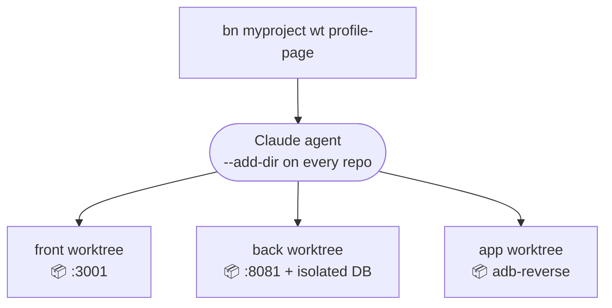
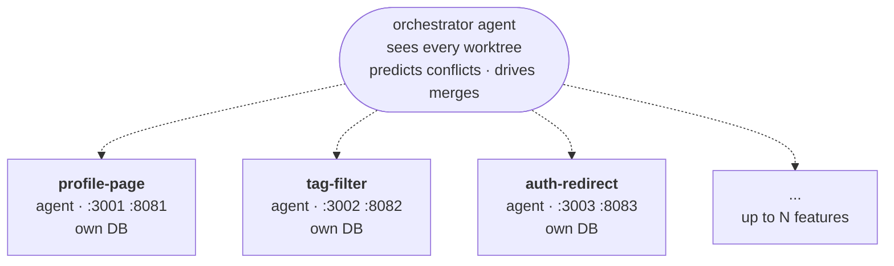

<div align="center">

```

                ░▒▓▓▒░         ░▒▒▓▒░
            ░▒▓▓▓▓▓▓▒▓▓▓▒▒▒▓▓▓▒▓▓▓▓▓▒░
          ░▒▓▓██▓▓▓▓▓▓▓▓▓▓▓▓▓▓▓▓██▓▓▓▒
        ▒▓▓▓▓▓▓▓▓▓▓▓██▓▓▓▓▓▓▓▓▓▓▓▓▓▓▓▓▓▒
       ▓▓▓▓▓▓▓▓▓▓▓▓▓▓▓▓▓▓▓▓▓▓██▓▓▓▓▓▓▓▓
      ▓▓██▓▓▓▓▓▓▓▓▓▓▓▓▓▓▓▓▓▓▓▓▓▓▓▓▓▓▓▓
      ▒▓▓▓▓▓▓▓▓▓▓▓▓▓▓▓▓▓▓▓▓▓▓▓▓▓▓▓▓▓▓▓▒
            ░░░  ░ ░░░ ░ ░░░  ░░░
             ┃┃    ███    ┃┃   █████   ┃┃
             ┃┃   ╱███    ┃┃   █████   ┃┃    ╲╲
             ┃┃    ███    ┃┃   █████   ┃┃     ╲╲
          ══╩╩════╩╩╩════╩╩═══╩╩╩╩╩═══╩╩══════╩╩

  ██████╗  █████╗ ███╗   ██╗██╗   ██╗ █████╗ ███╗   ██╗
  ██╔══██╗██╔══██╗████╗  ██║╚██╗ ██╔╝██╔══██╗████╗  ██║
  ██████╔╝███████║██╔██╗ ██║ ╚████╔╝ ███████║██╔██╗ ██║
  ██╔══██╗██╔══██║██║╚██╗██║  ╚██╔╝  ██╔══██║██║╚██╗██║
  ██████╔╝██║  ██║██║ ╚████║   ██║   ██║  ██║██║ ╚████║
  ╚═════╝ ╚═╝  ╚═╝╚═╝  ╚═══╝   ╚═╝   ╚═╝  ╚═╝╚═╝  ╚═══╝

```

**tmux + git worktrees + Claude Code, N features in parallel across N repos.**

[](https://github.com/LoicBch/banyan-cli/actions/workflows/ci.yml)
[](LICENSE)
[](package.json)

</div>

---

## The problem

Running multiple AI agents in parallel on the same project means each one needs:

- its own dev ports — agent B can't bind `:8080` if agent A already did
- its own git worktree per repo so branches don't fight each other
- its own DB / compose stack — you don't want agent B writing to agent A's MySQL
- its own `.env` values (auth tokens, feature flags) and the run process actually loading them
- a Claude session with `--add-dir` wired to every repo of the project, not just one
- and eventually, merging N branches across N repos without stepping on each other

That's 20–30 minutes of plumbing per agent, every time. So in practice most people just don't — they switch context, one feature at a time, with the rest of the stack idle.

---

## One command. Whole stack.

```bash
bn myproject wt profile-page
```



One feature branch, three worktrees, one agent that sees them all, dev ports allocated dynamically. Talk to the agent in its tmux pane.

```bash
bn myproject start profile-page
```

Runs `./gradlew bootRun`, `npm run dev`, the Android install — each in its own pane, on its own port. Cross-repo env wiring is automatic: the front's `REACT_APP_API_URL` already points at this feature's back, not someone else's.

```bash
bn myproject merge profile-page
bn myproject cleanup profile-page
```

Rebase, push, MR/PR, auto-resolve cross-feature conflicts, merge. Then full teardown: stop processes, remove worktrees, delete branches, drop DB volumes.

---

## Do it 10 times. Same machine. No collisions.



Different worktrees, different ports, different DBs, different agents. An orchestrator above the lot watches files × features overlap in real time and tells you the safe merge order.

---

## Install

```bash
git clone https://github.com/LoicBch/banyan-cli
cd banyan-cli && npm install && npm run build && npm link
bn install-tmux
```

Needs Node ≥ 20, tmux ≥ 3, git ≥ 2.5, and the [Claude Code CLI](https://docs.claude.com/claude-code). Optional: Docker (compose stacks), `gh`/`glab` (merges), `$OPENROUTER_API_KEY` (faster LLM-named features).

Set up your first project from the dashboard wizard:

```bash
bn serve
# http://localhost:4242 → "+ new project"
```

Or via CLI:

```bash
cd ~/front && bn init my-project
bn my-project add-repo back ~/back
bn my-project add-repo app ~/app
bn my-project start
```

---

## A short session

```text
$ bn myproject wt profile-page
  ✓ feature/profile-page worktrees created in front, back, app
  ✓ .env.local seeded into each worktree
  ✓ compose stack: myproject-profile-page (mysql:33061)
  ✓ agent pane opened (mode=autonomous)

$ bn myproject start profile-page
  back  : SERVER_PORT=8081 JWT_SECRET=… ./gradlew bootRun
  front : PORT=3001 REACT_APP_API_URL=http://localhost:8081 npm run dev
  app   : ./gradlew :app:installDebug    (adb reverse 8080→8081)

# A bug comes in. Don't touch profile-page — open a parallel context:
$ bn myproject wt tag-filter -p "fix infinite loop on tag filter"
  ✓ feature/tag-filter worktrees, agent, stack on :8082

$ bn myproject ls-features
  profile-page  running  3 panes  :3001 :8081
  tag-filter    running  2 panes  :3002 :8082

$ bn myproject merge tag-filter && bn myproject cleanup tag-filter
  ✓ rebase clean · pushed · MR merged · stack destroyed · worktrees removed

# Tomorrow morning, after reboot:
$ bn myproject resume
  ✓ panes restored · run processes restarted · claude --continue
```

---

## What else it does

<details>
<summary><b>Web dashboard</b> &nbsp;·&nbsp; pipeline view, config editor, conflict pulse, remote mode with QR</summary>

`bn serve` opens it at `localhost:4242`. Tabs: Pipeline (every feature × every repo), Inbox (integration tasks), History (agent reports timeline), Ask, Config (edit run commands with comment-preserving YAML writes), Shortcuts.

`bn serve --remote` exposes it over a Cloudflare tunnel with token auth and prints a QR code — monitor builds, approve plans, accept tasks from your phone.

</details>

<details>
<summary><b>Auto-managed .env</b> &nbsp;·&nbsp; seed gitignored files into worktrees + load them into the run process</summary>

```yaml
repos:
  - name: back
    copyOnWorktree:
      - .env.local
    loadEnvFiles:
      - .env.local
```

- `copyOnWorktree` copies the file from the main checkout into every fresh worktree on `bn wt`.
- `loadEnvFiles` parses `.env`-style files at spawn time and prepends `KEY=value` pairs to the run command — so Spring Boot, Django, plain Node, and Go all see the vars as actual env, not as a file they have to know how to read.
- Banyan's dynamic values (allocated port, composePorts, declared `run.env`) override the file. Per-feature isolation is automatic — each spawn has its own env block.

</details>

<details>
<summary><b>Agent modes</b> &nbsp;·&nbsp; interactive / assisted / autonomous / autopilot, with optional plan approval</summary>

```bash
bn myproject wt fix-search -p "the search bar lags above 500 items" -m autopilot --review-plan
```

- **interactive** — plain Claude, you drive
- **assisted** — agent asks on big decisions
- **autonomous** — agent decides everything, documents hesitations
- **autopilot** — autonomous + loops on Stop hook through a TODO list until `banyan_report_done`

`--review-plan` gates execution: the agent builds a TODO list and waits for `bn approve <feature>` before any work starts.

LLM-driven naming: `-p "<prompt>"` infers the slug via OpenRouter or `claude --print`. Skip the prompt and you get a draft worktree where the agent finalizes the name from your first message.

</details>

<details>
<summary><b>Conflict pulse + AI resolver</b> &nbsp;·&nbsp; see and fix cross-feature conflicts before they hurt</summary>

Live file × feature matrix in the dashboard. Color-coded overlap risk. Suggested merge order.

On merge/rebase conflict, banyan launches a headless Claude with `--add-dir` on every repo (so it sees sibling worktrees) and banyan MCP wired in. It can call `banyan_feature_status` to check how other features resolved the same files — consistent resolutions across the project, no context pollution in per-feature agents.

</details>

<details>
<summary><b>Task inbox</b> &nbsp;·&nbsp; pull from ClickUp (Linear/Jira adapters ~100 LOC each), spawn from the dashboard</summary>

```yaml
# ~/.config/banyan/integrations.yaml
sources:
  - type: clickup
    name: my-clickup
    pollIntervalMin: 5
    options:
      apiToken: pk_xxx
      listId: "901234"
```

Matching tasks land in the dashboard's Inbox tab. Click → spawn a feature with the task description as the first prompt to the agent.

</details>

<details>
<summary><b>Project memory</b> &nbsp;·&nbsp; <code>bn ask</code> answers from reports + commits + agent transcripts</summary>

```bash
bn myproject ask "what changed on auth this month?"
bn myproject ask "where did we land on the search bug?" -f search-fix
bn myproject ask "what's still pending?" --days 7
```

End-of-task reports (`banyan_report_done`) and per-feature TODO lists feed `bn ask` too. The dashboard's History tab shows the timeline with watch/notify.

</details>

<details>
<summary><b>MCP server</b> &nbsp;·&nbsp; every banyan operation exposed to Claude Code / Cursor</summary>

```json
{ "mcpServers": { "banyan": { "command": "banyan", "args": ["mcp-serve"] } } }
```

Tools cover the full lifecycle: `banyan_create_feature`, `banyan_merge_feature`, `banyan_list_features`, `banyan_get_stack_ports`, todos, reports, and dispatch to per-feature agents. The orchestrator gets these wired in automatically.

</details>

<details>
<summary><b>Discord Rich Presence</b> &nbsp;·&nbsp; current project + active features + mode in your status</summary>

When the dashboard is running, your Discord status reflects what you're working on: project name, list of active feature names (with `+N more` overflow), and overall mode (autonomous/supervised). Toggle each field in config.

</details>

<details>
<summary><b>Hooks</b> &nbsp;·&nbsp; shell scripts at every lifecycle transition for the long-tail customisation</summary>

`worktree_created`, `before_worktree_remove`, `worktree_removed`, `stack_up`, `stack_down`, `pre_merge`, `post_merge`, `pre_test`, `post_test`. Three lookup levels: team-versioned, local override, global per user. Each hook receives `BANYAN_PROJECT`, `BANYAN_FEATURE`, `BANYAN_REPO`, `BANYAN_WORKTREE_PATH`, etc.

For seeding gitignored files, prefer the declarative `copyOnWorktree` field. Reach for `worktree_created` when you need templating, secret managers, hardlinks, or anything the declarative field doesn't cover.

</details>

<details>
<summary><b>Survives reboots</b> &nbsp;·&nbsp; <code>bn resume</code> restores panes, processes, conversations</summary>

Walks every active worktree on disk, recreates the tmux panes, restarts run processes for features that had a `bn start`, resumes Claude via `--continue` so each conversation is preserved. Compose volumes survive (Docker keeps them), recorded port allocations survive.

</details>

---

## Reference

<details>
<summary>Configuration schema</summary>

```yaml
version: 1
projects:
  - name: myproject
    deployCommand: bash ~/Dev/myproject/deploy.sh
    repos:
      - name: front
        path: ~/Dev/myproject/front
        baseBranch: develop
        copyOnWorktree: [.env.local]
        loadEnvFiles: [.env.local]
        run:
          command: npm run dev
          port: 3000
          portEnv: PORT
          setup: npm install
          env:
            REACT_APP_API_URL: http://localhost:{{back.port}}
      - name: back
        path: ~/Dev/myproject/back
        baseBranch: develop
        copyOnWorktree: [.env.local, src/main/resources/application-local.yml]
        loadEnvFiles: [.env.local]
        run:
          command: ./gradlew bootRun
          port: 8080
          portEnv: SERVER_PORT
          stopCommand: ./gradlew --stop
          composePorts:
            DB_PORT: mysql-dev:3306
      - name: app
        path: ~/AndroidStudio/Mobile
        baseBranch: develop
        copyOnWorktree: [local.properties]
        run:
          command: ./gradlew :app:installDebug && adb shell am start -n com.example/.MainActivity
      - name: infra
        type: compose
        path: ~/Dev/myproject/back
        composeFile: docker-compose.dev.yml
```

Stored at `~/.config/banyan/config.yaml`. Edit directly, via the dashboard's Config tab, or with `bn <project> add-repo / set-run / set-base`.

</details>

<details>
<summary>Command list</summary>

```
bn ls                                    list projects
bn init <project>                        create a project
bn ask "<question>"                      answer from project memory
bn serve [--remote]                      web dashboard
bn install-tmux [-f]                     render tmux config

bn <project> start [feature] [repos...]  workspace (no feature) or run processes (with)
bn <project> stop <feature>              stop run processes
bn <project> close                       close the tmux session (worktrees on disk kept)
bn <project> attach / status / resume / ls-features / ports
bn <project> deploy [repo] [args...]

bn <project> wt [feature] [repos...]     create worktree(s) + agent pane
  -p "<prompt>"   LLM-named slug from prompt
  -m <mode>       interactive | assisted | autonomous | autopilot
  --review-plan   require approval before work starts
  --prefix <p>    branch prefix (default 'feature')
bn <project> task <feature> <prompt>     paste into the feature's agent pane
bn <project> wt-rm <feature> [repo]
bn <project> wt-ls
bn <project> rebase <feature> [repo]
bn <project> merge <feature> [repo]
bn <project> cleanup <feature> [repo]    stop + remove + delete + close + drop

bn <project> todo <feature>
bn <project> reports [feature]
bn <project> approve <feature>           approve a pending plan or report

bn <project> env up|down|recreate|logs|exec <feature> [service ...]

bn <project> add-repo / remove-repo / remove / set-base / set-run / infer-run
```

If you're inside a configured repo (or its worktree), drop the project name — banyan infers it from cwd. Or symlink `banyan` to your project name to skip the project arg entirely.

</details>

<details>
<summary>Dev</summary>

```bash
npm run dev      # tsc --watch
npm test         # node --test on dist/test
npm run clean
```

231 tests, CI runs on Ubuntu + macOS × Node 20 + 22.

</details>

---

[Contributing](CONTRIBUTING.md) · [Changelog](CHANGELOG.md) · MIT licensed
